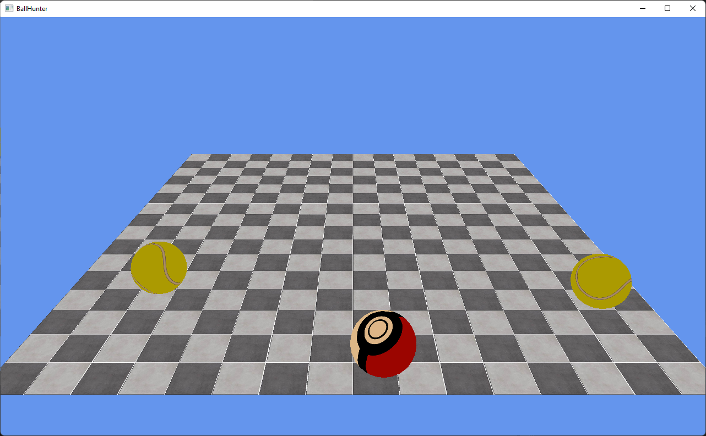

# Demo Project for Game developing

# Architecture

- Platform Layer

  including platform specified implementation or rendering (only DirectX is implemented so far)

- Engine Layer

  including components of a game engine, renderer/input/audio/objects ...

- Game Layer

  including the business logic of the game


# Third party libraries
1. easylogging++, logging library
2. sdl2, for cross-platform window/input management
3. mathfu, math library
4. reactphysics3d, physics engine
5. DirectXTK, a convenient wrapper library for DirectX

The DirectXTK and SDL2 are managed by VCPKG, the remaining are source included.


# Build 

> Please install vcpkg first 

For windows platform, run the following command to generate the project files

```bat
generate-win-proj.bat -DCMAKE_TOOLCHAIN_FILE=$VCPKG_ROOT/scripts/buildsystems/vcpkg.cmake
```

